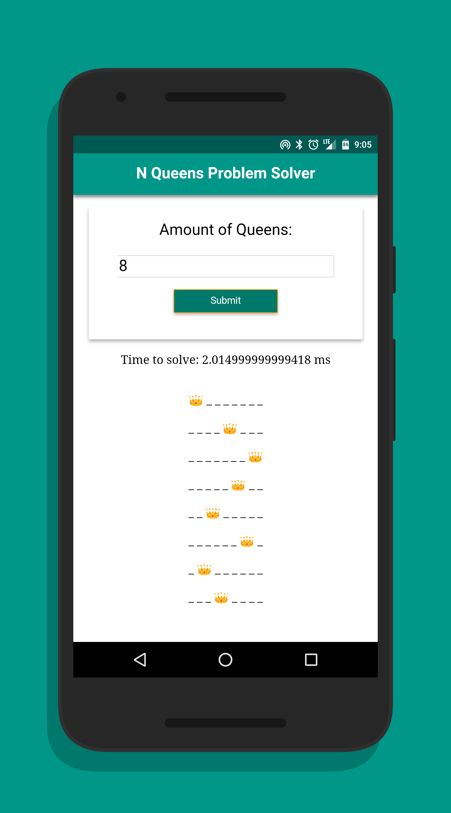
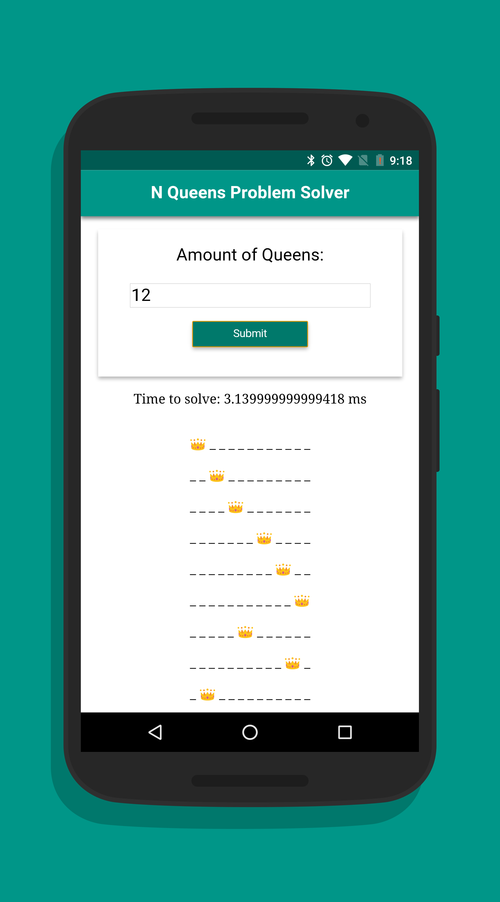

# n-queens
A JavaScript (ES 2015) implementation of the N-Queens 👑 Problem solver.

# Usage
Clone repo:
- `$ git clone https://github.com/giovanni0918/n-queens.git`

Install dependencies (assumes node is installed):
- `$ npm install`

Build dist directory:
- `$ gulp`

Serve locally (assumes php or python is installed):
- `$ php -S localhost:8000`
- alt: `$ python -m http.server 8000`

# Demo it
<https://giovanni0918.github.io/n-queens/>

# Screenshots

8 Queens - Nexus 5x: 2.4750ms

12 Queens - Nexus 6: 3.3299ms

32 Queens - iPad Air 2: 91360.1450ms

# License
- MIT: <https://mit-license.org>
- Copyright 2016: [Giovanni Orlando Rivera](https://github.com/giovanni0918)
- Website: <http://giovanni-orlando.com>
