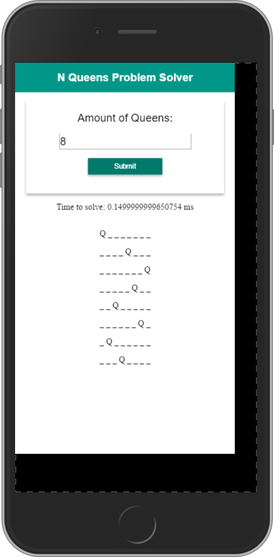
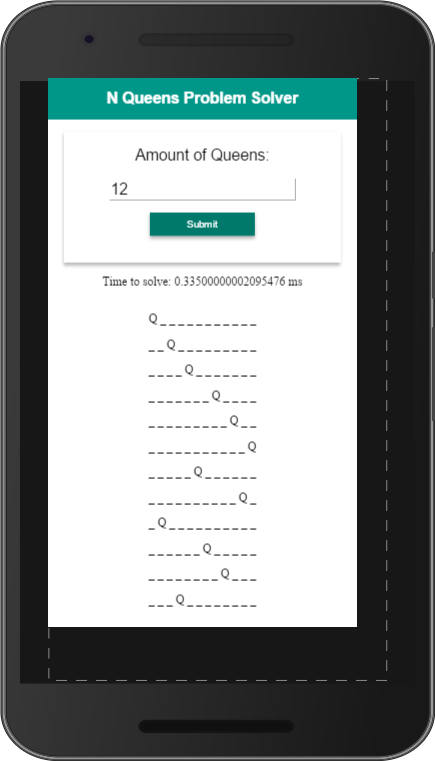
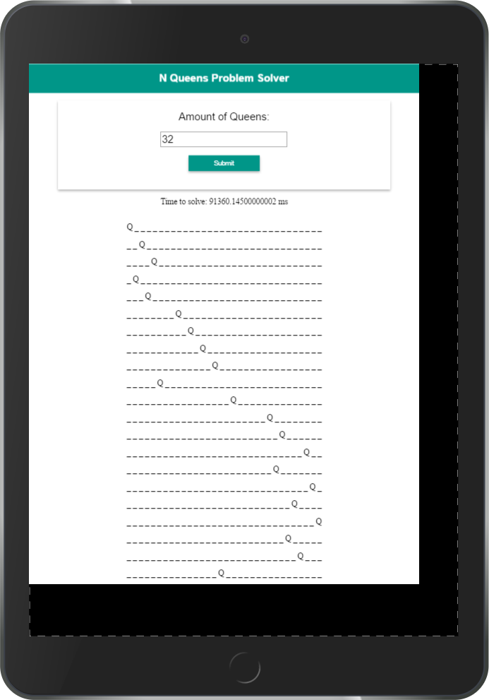

# n-queens
A JavaScript (ES 2015) implementation of the N-Queens 👑 Problem solver.

# Usage
1. Clone repo:
- `$ git clone https://github.com/giovanni0918/n-queens.git`

2. Install dependencies (assumes node is installed):
- `$ npm install`

3. Build dist directory:
- `$ gulp`

# Screenshots

8 Queens - iPhone 6 Plus: 0.1499ms

12 Queens - Nexus 6p: 0.3350ms

32 Queens - iPad Air 2: 91360.1450ms

# License
- MIT: <https://mit-license.org>
- Copyright 2016: [Giovanni Orlando Rivera](https://github.com/giovanni0918)
- Website: <http://giovanni-orlando.com>
